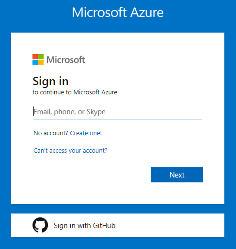

How to deploy AI model to AIBox by Azure
===
---

# Table of Contents

-   [Introduction](#Introduction)
-   [Part 1: Config Azure Iot Hub](#part_1)
-   [Part 2: Prepare docker container](#part_2)
-   [Part 3: Deployment by Azure](#part_3)

# Introduction

**About this document**

This document describes how to cover your AI Models, then deploy models to your AIBox via Azure Iot Hub.

# Part 1: Config Azure Iot Hub

## 1.1 Active your Azure account

AIBox can be configured to work with Microsoft Azure IoT resources. To get started, you will need a new or existing Azure account. You can create a free account by visiting [Azure link](https://azure.microsoft.com/free)

## 1.2 Setup IoT Hub and IoTEdge Device

Follow steps to [create your IoT Hub ](https://docs.microsoft.com/en-us/azure/iot-hub/iot-hub-create-through-portal) in advances

In the Azure portal, IoT Edge devices would be created and managed separately from devices that connect to your IoT hub but aren't edge-enabled. Follow below steps for configurations

- Sign in to the [Azure portal](https://portal.azure.com) and navigate to your IoT hub.

- Select IoT Edge from the menu.

- Select Add an IoT Edge device

- Provide a descriptive device ID. Use the default settings to auto-generate authentication keys and connect the new device to your hub.
- Select Save.

# Part 2: Prepare docker container

# Step 3: Deployment by Azure

  