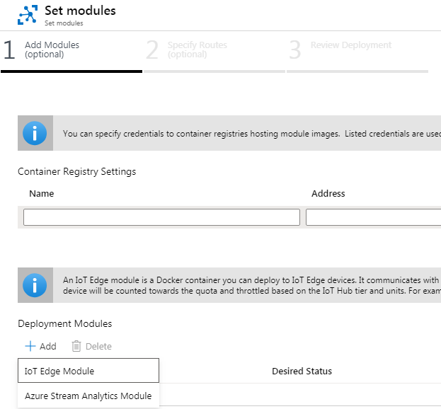
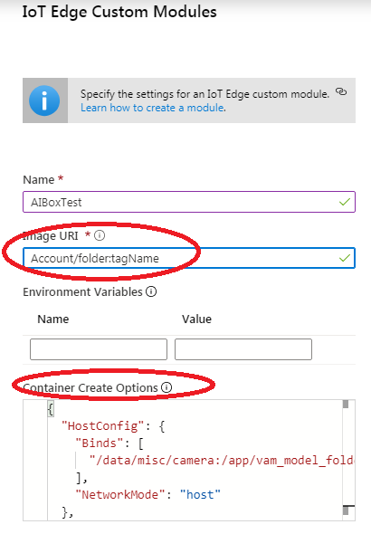

How to deploy AI model to AIBox by Azure
===
---

# Table of Contents

-   [Introduction](#Introduction)
-   [Part 1: Config Azure Iot Hub](#part_1)
-   [Part 2: Create your IotEdge Module for AIBox](#part_2)
-   [Part 3: Deployment by Azure](#part_3)


<a name="Introduction"></a>
# Introduction

**About this document**

This document describes how to cover your AI Models, then deploy models to your AIBox via Azure Iot Hub.

<a name="part_1"></a>
# Part 1: Config Azure Iot Hub

## 1.1 Active your Azure account

AIBox can be configured to work with Microsoft Azure IoT resources. To get started, you will need a new or existing Azure account. You can create a free account by visiting [Azure link](https://azure.microsoft.com/free)

## 1.2 Setup IoT Hub and IoTEdge Device

Follow steps to [create your IoT Hub ](https://docs.microsoft.com/en-us/azure/iot-hub/iot-hub-create-through-portal) in advances

In the Azure portal, IoT Edge devices would be created and managed separately from devices that connect to your IoT hub but aren't edge-enabled. Follow below steps for configurations

- Sign in to the [Azure portal](https://portal.azure.com) and navigate to your IoT hub.


- Select IoT Edge from the menu.


- Select Add an IoT Edge device


- Provide a descriptive device ID. Use the default settings to auto-generate authentication keys and connect the new device to your hub.
- Select Save.


<a name="save_conectStr"></a>
- You will have one IoT Edge Devices Connect String (Primary connection String) for your AIBox


<a name="part_2"></a>
# Part 2: Create your IotEdge Module for AIBox

You have to create one edge device Module, running at AIBox. Please refer to [link](https://docs.microsoft.com/en-us/azure/iot-edge/tutorial-python-module#create-a-container-registry) for detail. 

May need register [docker hub](https://hub.docker.com/) account and public your container at docker hub (ex.  Account/folder:tagName)

Follows are some sample code by python for AIBox
- Model Deployment
```
shutil.copy("/app/Data/dlcFiles/ModelConfig_1.txt","/app/vam_model_folder/ModelConfig_1.txt")
                        shutil.copy("/app/Data/dlcFiles/ModelConfig_2.txt","/app/vam_model_folder/ModelConfig_2.txt")
                        copy_tree("/app/Data/dlcFiles/altekDLC1","/app/vam_model_folder/altekDLC1")
                        copy_tree("/app/Data/dlcFiles/altekDLC2","/app/vam_model_folder/altekDLC2")
```

- Receive Inference result by RTSP Client
```
cmd = ['gst-launch-1.0 ', ' -q ', ' rtspsrc ', ' location=' + result_src, ' protocols=tcp ',                                
       ' ! ', " application/x-rtp, media=application ", ' ! ', ' fakesink ', ' dump=true ']                                 
cmd = ''.join(cmd)                                                                                                                                                                                                                              
try:                                                                                                                        
    self._sub_proc = subprocess.Popen(                                                                                      
    cmd, shell=True, stdout=subprocess.PIPE, stderr=subprocess.PIPE, bufsize=1, universal_newlines=False)                                                                                                                               
    for _ in repeat(None):                                                                                                  
        line = self._sub_proc.stdout.readline()                                                                                                                                                                                         
        l_str = line[70:-1]                                                                                                 
        l_str = l_str.decode('utf-8')                                                                                       
        l_str = l_str.strip()                                                                                               
                                                                                                                    
        if ":[" in self._json_str and "] }" in self._json_str + l_str:                                                      
            # Only yield if objects are present in the inferences                                                           
            self._json_str = self._json_str + l_str                                                                         
            s_idx = self._json_str.index('{ "')                                                                             
            e_idx = self._json_str.index("] }") + 3                                                                         
            self._json_str = self._json_str[s_idx:e_idx]                                                                    
            result = self._get_inference_result()                                                                           
            self._json_str = ""                                                                                             
            yield result                                                                                                    
        elif ":[" not in self._json_str and '{ "' in self._json_str and " }" in self._json_str + 'l_str':                   
            self._json_str = ""                                                                                             
        else:                                                                                                               
            self._json_str = self._json_str + l_str                                                                         
        pass                                                                                                                
except subprocess.CalledProcessError as e:                                                                                  
    print(e)

```


<a name="part_3"></a>
# Part 3: Deployment by Azure

1.	Select your IoT edge device, click on Set modules


2. At Deployment modules section, click on Add => IoT Edge Module.



3. Fill out following details, and click save.

- Image URI: Account/folder:tagName
- Container Create Options: Redirect model files to path that they are really located at.
```
{
  "HostConfig": {
    "Binds": [
      "/data/misc/camera:/app/vam_model_folder"
    ],
    "NetworkMode": "host"
  },
  "NetworkingConfig": {
    "EndpointsConfig": {
      "host": {}
    }
  }
} 

```




4.	Press Next at the 1st Add Modules (optional) tab in Set module page.

5.	Press Next at the 2nd Specify Routes (optional) tab to remains unchanged.

6. At the 3rd Review Deployment tab, press Submit

7. You will see there are 3 modules as below.


8. Prefer to [Part 1](#part_1) to [get connection string](#save_conectStr)

9. Refer to [Quick Start Guiding for AIBox By Azure](./aibox-linux-for-edge.md) to setup network configuration of AIBox. Remember save your display out config before rebooting AIBox.

You may use below shell cmd via SSH to update connect string into device.

```
sed -i '/ device_connection_string: /c\  device_connection_string: "HostName={hub_name}.azure-devices.net;DeviceId=MyEdgeDeviceName;SharedAccessKey={key}"' /etc/iotedge/config.yaml
```

Then, you can use below cmd to reboot AIBox via SSH
Wait for minutes to see all LED off, then have Power-On status

```
reboot
//systemctl daemon-reload
//systemctl restart iotedge.service
```