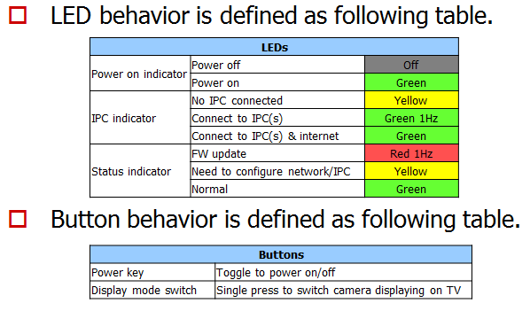
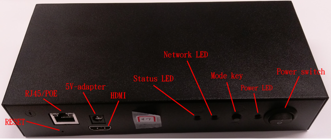

Run a simple python sample on Altek AIBox device running embedded Linux by Yocto
===
---

# Table of Contents

-   [Introduction](#Introduction)
-   [Step 1: Prerequisites](#Prerequisites)
-   [Step 2: Prepare your Device](#PrepareDevice)
-   [Step 3: Manual Test for Azure IoT Edge on device](#Manual)
-   [Step 4: Next Steps](#NextSteps)
-   [Step 5: Troubleshooting](#Step-5-Troubleshooting)

# Introduction

**About this document**

This document describes how to connect Altek AIBox device running embedded Linux by Yocto with Azure IoT Edge Runtime pre-installed and Device Management. This multi-step process includes:

-   Configuring Azure IoT Hub
-   Registering your IoT device
-   Build and Deploy client component to test device management capability 

# Step 1: Prerequisites

You should have the following items ready before beginning the process:

-   [Prepare your development environment][setup-devbox-linux]
-   [Setup your IoT hub](https://account.windowsazure.com/signup?offer=ms-azr-0044p)
-   [Provision your device and get its credentials][lnk-manage-iot-hub]
-   [Sign up to IOT Hub](https://account.windowsazure.com/signup?offer=ms-azr-0044p)
-   [Add the Edge Device](https://docs.microsoft.com/en-us/azure/iot-edge/quickstart-linux)
-   [Add the Edge Modules](https://docs.microsoft.com/en-us/azure/iot-edge/quickstart-linux#deploy-a-module)
-   [Altek AIBox device](https://store.altek.com.tw/qualcomm/product/ai-box-altek#TECH-NODE)
-   x1~x4 IPCam, compatible with Onvif profile-s and RTSP
-   {{Please specify if any other software(s) or hardware(s) are required.}}

# Step 2: Prepare your Device

This section will guide you to setup connection of IPCamera and AIBox. 

Before starting setup, you may refer to below LED indicator/ Button scenarios as below
 

 

## What you will do?

### 1. Connect your IPCamera to Wi-Fi AP or ethernet router.

You may refer to user manual to setup your IPCamera, and ensure your IPCamera can be accessed via OnVIF + RTSP protocol.

### 2. Setup your network connection for AIBox

# Step 3: Manual Test for Azure IoT Edge on device

This section walks you through the test to be performed on the Edge devices running the Linux operating system such that it can qualify for Azure IoT Edge certification.

## 3.1 Edge RuntimeEnabled (Mandatory)

**Details of the requirement:**

The following components come pre-installed or at the point of distribution on the device to customer(s):

-   Azure IoT Edge Security Daemon
-   Daemon configuration file
-   Moby container management system
-   A version of `hsmlib` 

*Edge Runtime Enabled:*

**Check the iotedge daemon command:** 

Open the command prompt on your IoT Edge device , confirm that the Azure IoT edge Daemon is under running state

    systemctl status iotedge

 

Open the command prompt on your IoT Edge device, confirm that the module deployed from the cloud is running on your IoT Edge device

    sudo iotedge list

  

On the device details page of the Azure, you should see the runtime modules - edgeAgent, edgeHub and tempSensor modueles are under running status

 

## 3.2 Device Management (Optional)

**Pre-requisites:** Device Connectivity.

**Description:** A device that can perform basic device management operations (Reboot and Firmware update) triggered by messages from IoT Hub.

## 3.2.1 Firmware Update (Using Microsoft SDK Samples):

Specify the path {{enter the path}} where the firmwareupdate client components are installed.

To run the simulated device application, open a shell or command prompt window and navigate to the **iot-hub/Tutorials/FirmwareUpdate** folder in the Node.js project you downloaded. Then run the following commands:

    npm install
    node SimulatedDevice.js "{your device connection string}"

To run the back-end application, open another shell or command prompt window. Then navigate to the **iot-hub/Tutorials/FirmwareUpdate** folder in the Node.js project you downloaded. Then run the following commands:

    npm install
    node ServiceClient.js "{your service connection string}"

IoT device client will get the message and report the status to the device twin.

 

**Update firmware**

Confirm the IoT hub, Device ID, method name and method payload as below:

-   Press “call Method” button
-   Check the returning status as below:

 

## 3.2.2 Reboot (Using Microsoft SDK Samples):

Specify the path {{enter the path}} where the components are installed 

Confirm the IoT hub, Device ID, method name as below:

-   Press “call Method” button
-   Check the returning status as below:

 

IoT device client will get the message and report the status to the device twin.

 
  
## 3.3.3 Firmware Update (Modified SDK samples/Custom made application):

If the Client components are custom made please add the steps to execute the Firmware Update through Device Twin.

**Note**: Client Components must be shipped with the device 

## 3.3.4 Reboot (Modified SDK samples/Custom made application):

If the Client components are custom made please add the steps to execute the Device Reboot through Direct Methods

**Note**: Client Components must be shipped with the device 

# Step 4: Next steps

Once you shared the documents with us, we will contact you in the following 48 to 72 business hours with next steps.

# Step 5: Troubleshooting

Please contact engineering support on **<mailto:iotcert@microsoft.com>** for help with troubleshooting.
  
[setup-devbox-linux]: https://github.com/Azure/azure-iot-sdk-c/blob/master/doc/devbox_setup.md
[lnk-setup-iot-hub]: ../setup_iothub.md
[lnk-manage-iot-hub]: ../manage_iot_hub.md
